## Overview

This is a study of the Glosten and Milgrom model for market making.

#### Experiment 01

This chart shows the true price and market price over a period of 25 time steps:

#### Experiment 02

This chart shows the true price and market price over a period of 25 time steps:

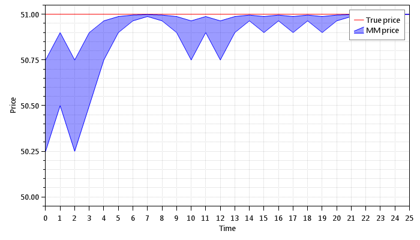

This chart shows the market maker's belief about the price after 10 time steps:

#### Experiment 03

This chart shows the true price and market price over a period of 25 time steps:

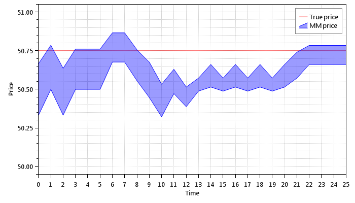

This chart shows the market maker's belief about the price after 25 time steps:

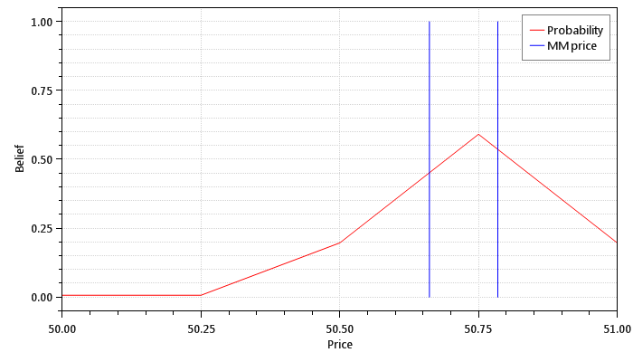

#### Experiment 04

This chart shows the true price and market price over a period of 25 time steps:

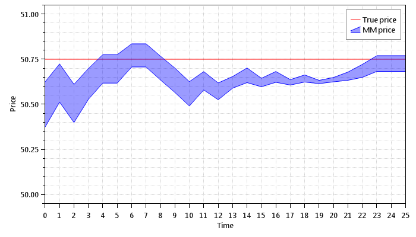

This chart shows the market maker's belief about the price after 25 time steps:

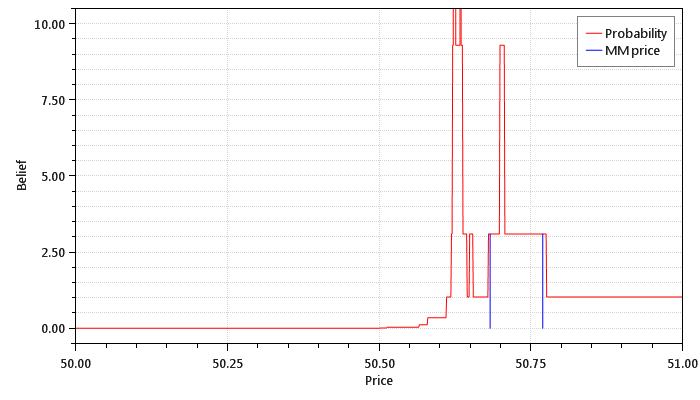

#### Experiment 05

This chart shows the true price and market price over a period of 25 time steps:

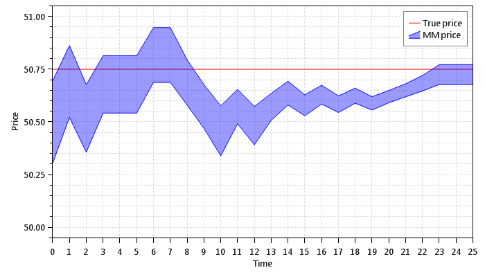

This chart shows the market maker's belief about the price after 25 time steps:

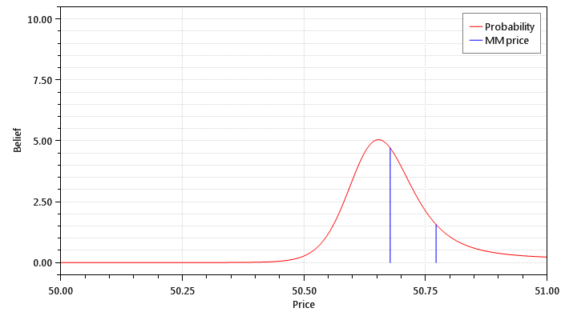

#### Experiment 06

This chart shows the true price and market price over a period of 25 time steps:

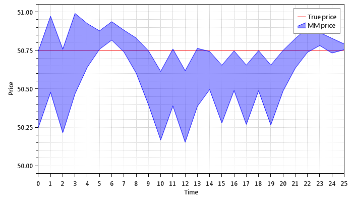

This chart shows the market maker's belief about the price after 25 time steps:

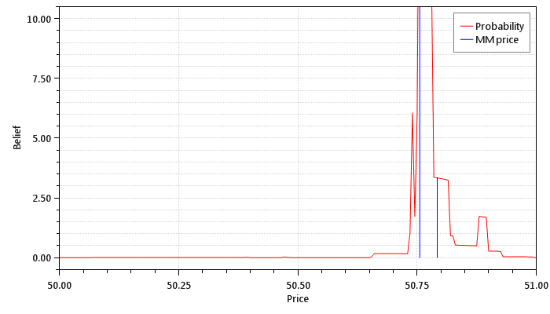

#### Experiment 07

This chart shows the true price and market price over a period of 25 time steps:

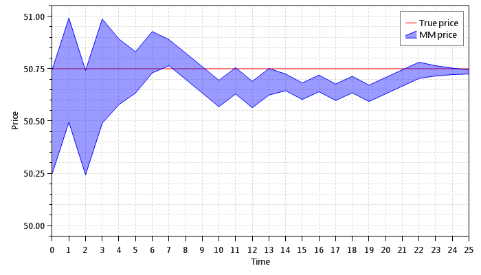

This chart shows the market maker's belief about the price after 25 time steps:

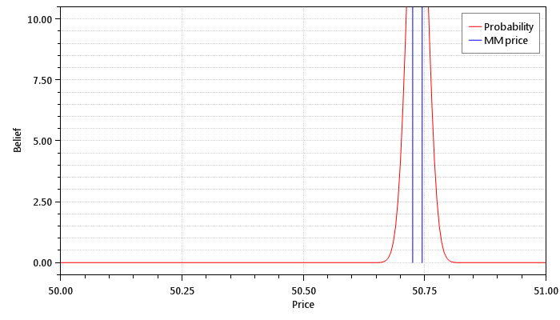

## References

* *Bid, Ask, and Transaction Prices in a Specialist Market with Heterogeneously Informed Traders* by Lawrence R. Glosten and Paul R. Milgrom

* *A Learning Market-Maker in the Glosten-Milgrom Model* by Sanmay Das

* *Market Microstructure Theory* by Maureen O'Hara

* *An Intuitive (and Short) Explanation of Bayes' Theorem* by Kalid Azad
